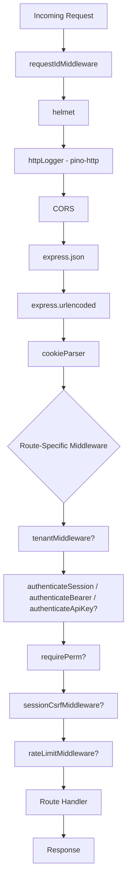

# Middleware Pipeline

## Overview

Cerberus IAM uses a carefully ordered middleware pipeline to handle cross-cutting concerns like request identification, security, authentication, tenant context, and rate limiting. Middleware is applied in `src/app.ts` via the `createApp()` function.

## Middleware Execution Order



## Global Middleware (Applied to All Routes)

### 1. Request ID Middleware

**File:** `src/middleware/requestId.ts`

**Purpose:** Assigns a unique ID to every request for tracing and debugging.

**Behavior:**

- Checks for `X-Request-ID` header from client
- If not present, generates a UUID v4
- Attaches to `req.id` and returns in `X-Request-ID` response header

**Code:**

```typescript
export function requestIdMiddleware(req: Request, res: Response, next: NextFunction): void {
  req.id = (req.headers["x-request-id"] as string) || generateUuid();
  res.setHeader("X-Request-ID", req.id);
  next();
}
```

**Type Extension:**

```typescript
declare global {
  namespace Express {
    interface Request {
      id: string;
    }
  }
}
```

### 2. Helmet (Security Headers)

**Library:** `helmet@7.0.0`

**Purpose:** Sets secure HTTP headers to protect against common vulnerabilities.

**Headers Applied:**

- `X-Content-Type-Options: nosniff`
- `X-Frame-Options: DENY`
- `X-XSS-Protection: 0` (disabled in favor of CSP)
- `Strict-Transport-Security` (HSTS)
- `Content-Security-Policy` (default restrictive policy)

**Usage:**

```typescript
app.use(helmet());
```

### 3. HTTP Logger (Pino HTTP)

**File:** `src/logger.ts`

**Purpose:** Logs all HTTP requests with structured JSON format.

**Logged Fields:**

- Request ID
- HTTP method
- URL path
- Remote IP address
- Response status code
- Response time

**Configuration:**

```typescript
const httpLogger = pinoHttp({
  logger,
  autoLogging: true,
  serializers: {
    req(request) {
      return {
        id: request.id,
        method: request.method,
        url: request.url,
        remoteAddress: request.socket?.remoteAddress,
      };
    },
    res(response) {
      return {
        statusCode: response.statusCode,
      };
    },
  },
});
```

### 4. CORS (Cross-Origin Resource Sharing)

**Library:** `cors@2.8.5`

**Purpose:** Controls which origins can access the API.

**Configuration:**

```typescript
const buildCorsOptions = (): CorsOptions => {
  const explicitOrigins = [config.ADMIN_WEB_ORIGIN, config.ADMIN_WEB_INTERNAL_ORIGIN].filter(
    Boolean,
  );

  const allowList = new Set<string>([
    "http://localhost:3000",
    "https://localhost:3000",
    "http://localhost:5173",
    "https://localhost:5173",
    ...explicitOrigins,
  ]);

  return {
    origin: (origin, callback) => {
      if (!origin || allowList.has(origin)) {
        return callback(null, true);
      }
      return callback(new Error(`Origin ${origin} not allowed by CORS policy`));
    },
    credentials: true, // Allow cookies
  };
};

app.use(cors(buildCorsOptions()));
```

**Behavior:**

- Allows requests without `Origin` header (e.g., Postman)
- Validates `Origin` header against allow-list
- Enables `Access-Control-Allow-Credentials` for cookie-based auth

### 5. Body Parsers

**Purpose:** Parse incoming request bodies.

**JSON Parser:**

```typescript
app.use(express.json());
```

- Parses `application/json` content type
- Populates `req.body` with parsed object

**URL-Encoded Parser:**

```typescript
app.use(express.urlencoded({ extended: true }));
```

- Parses `application/x-www-form-urlencoded` content type
- Supports nested objects with `extended: true`

### 6. Cookie Parser

**Library:** `cookie-parser@1.4.6`

**Purpose:** Parses `Cookie` header and populates `req.cookies`.

```typescript
app.use(cookieParser());
```

**Usage:**

```typescript
const sessionToken = req.cookies[config.SESSION_COOKIE_NAME];
```

## Route-Specific Middleware

### Tenant Middleware

**File:** `src/middleware/tenant.ts`

**Purpose:** Establishes multi-tenant context from `X-Org-Domain` header.

**Applied To:** Most API routes under `/v1`

**Flow:**

1. Extract `X-Org-Domain` header
2. Query database for organisation by slug
3. Check if organisation exists and is not deleted
4. Attach to `req.tenant`

**Code:**

```typescript
export async function tenantMiddleware(
  req: Request,
  res: Response,
  next: NextFunction,
): Promise<void> {
  const orgSlug = req.headers["X-Org-Domain"] as string;

  if (!orgSlug) {
    sendProblem(res, badRequest("Missing X-Org-Domain header"));
    return;
  }

  const organisation = await prisma.organisation.findUnique({
    where: { slug: orgSlug, deletedAt: null },
  });

  if (!organisation) {
    sendProblem(res, notFound(`Organisation '${orgSlug}' not found`));
    return;
  }

  req.tenant = {
    id: organisation.id,
    slug: organisation.slug,
    organisation,
  };

  next();
}
```

**Type Extension:**

```typescript
declare global {
  namespace Express {
    interface Request {
      tenant?: {
        id: string;
        slug: string;
        organisation: Organisation;
      };
    }
  }
}
```

### Authentication Middleware

**File:** `src/middleware/authn.ts`

**Purpose:** Authenticates requests via session cookies, Bearer tokens, or API keys.

#### 1. Session Authentication

**Function:** `authenticateSession`

**Applied To:** Admin UI routes (`/v1/me`, `/v1/admin`)

**Flow:**

1. Extract session token from `cerb_sid` cookie
2. Verify session is valid and not expired
3. Check idle timeout
4. Load user with roles and permissions
5. Verify user is not blocked
6. Verify session belongs to tenant context
7. Attach `req.user` and `req.authOrganisation`
8. Update last activity timestamp

**Code:**

```typescript
export async function authenticateSession(
  req: Request,
  res: Response,
  next: NextFunction,
): Promise<void> {
  const sessionToken = req.cookies[config.SESSION_COOKIE_NAME];

  if (!sessionToken) {
    sendProblem(res, unauthorized("No session cookie found"));
    return;
  }

  const sessionData = await getSessionByToken(sessionToken);

  if (!sessionData) {
    res.clearCookie(config.SESSION_COOKIE_NAME);
    sendProblem(res, unauthorized("Invalid or expired session"));
    return;
  }

  if (sessionData.user.blockedAt) {
    sendProblem(res, unauthorized("User account is blocked"));
    return;
  }

  if (req.tenant && req.tenant.id !== sessionData.organisation.id) {
    res.clearCookie(config.SESSION_COOKIE_NAME);
    sendProblem(res, forbidden("Session does not match organisation context"));
    return;
  }

  req.user = sessionData.user as User;
  req.authOrganisation = sessionData.organisation;

  next();
}
```

#### 2. Bearer Token Authentication

**Function:** `authenticateBearer`

**Applied To:** OAuth 2.0 protected resources (e.g., `/oauth2/userinfo`)

**Flow:**

1. Extract token from `Authorization: Bearer <token>` header
2. Verify JWT signature and claims
3. Attach minimal user info to `req.user`

**Code:**

```typescript
export async function authenticateBearer(
  req: Request,
  res: Response,
  next: NextFunction,
): Promise<void> {
  const authHeader = req.headers.authorization;

  if (!authHeader || !authHeader.startsWith("Bearer ")) {
    sendProblem(res, unauthorized("Missing or invalid Authorization header"));
    return;
  }

  const token = authHeader.substring(7);

  try {
    const payload = await verifyJWT(token);

    req.user = {
      id: payload.sub,
      organisationId: payload.org,
    } as User;

    next();
  } catch {
    sendProblem(res, unauthorized("Invalid or expired token"));
  }
}
```

#### 3. Optional Authentication

**Function:** `optionalAuth`

**Applied To:** Routes that work with or without authentication

**Flow:**

1. Try session authentication first
2. If no session, try Bearer token
3. If both fail, continue without authentication

**Code:**

```typescript
export async function optionalAuth(req: Request, res: Response, next: NextFunction): Promise<void> {
  const sessionToken = req.cookies[config.SESSION_COOKIE_NAME];
  const authHeader = req.headers.authorization;

  if (sessionToken) {
    const sessionData = await getSessionByToken(sessionToken);
    if (sessionData && !sessionData.user.blockedAt) {
      req.user = sessionData.user as User;
      req.authOrganisation = sessionData.organisation;
    }
  } else if (authHeader && authHeader.startsWith("Bearer ")) {
    const token = authHeader.substring(7);
    try {
      const payload = await verifyJWT(token);
      req.user = {
        id: payload.sub,
        organisationId: payload.org,
      } as User;
    } catch {
      // Ignore invalid tokens
    }
  }

  next();
}
```

#### 4. API Key Authentication

**File:** `src/middleware/apikey.ts`

**Function:** `authenticateApiKey`

**Applied To:** Programmatic API access routes

**Flow:**

1. Extract API key from `Authorization: Bearer <key>` header
2. Verify key is valid and not revoked
3. Load scopes from API key
4. Attach `req.user` and `req.apiKeyScopes`

**Code:**

```typescript
export async function authenticateApiKey(
  req: Request,
  res: Response,
  next: NextFunction,
): Promise<void> {
  const authHeader = req.headers.authorization;

  if (!authHeader || !authHeader.startsWith("Bearer ")) {
    sendProblem(res, unauthorized("Missing or invalid API key"));
    return;
  }

  const key = authHeader.substring(7);
  const apiKey = await apiKeyService.verify(key);

  if (!apiKey) {
    sendProblem(res, unauthorized("Invalid or expired API key"));
    return;
  }

  req.user = {
    id: "api-key",
    organisationId: apiKey.organisationId,
  } as User;

  req.tenant = {
    id: apiKey.organisationId,
    slug: "",
    organisation: null as never,
  };

  req.apiKeyScopes = Array.isArray(apiKey.scopes) ? apiKey.scopes : [];

  next();
}
```

**Type Extension:**

```typescript
declare global {
  namespace Express {
    interface Request {
      user?: User;
      authOrganisation?: Organisation;
      apiKeyScopes?: string[];
    }
  }
}
```

### RBAC Middleware (Permission Checking)

**File:** `src/middleware/rbac.ts`

**Purpose:** Enforce role-based access control using permissions.

**Factory Function:** `requirePerm(permission: string)`

**Flow:**

1. Check if user is authenticated
2. Load user permissions (cached per request)
3. Check for wildcard permission (`*`)
4. Check for exact permission match
5. Check for resource wildcard (`resource:*`)
6. Deny if no match

**Code:**

```typescript
export function requirePerm(permission: string) {
  return async (req: Request, res: Response, next: NextFunction): Promise<void> => {
    if (!req.user) {
      sendProblem(res, unauthorized("Authentication required"));
      return;
    }

    const permissions = await getPermissionsForRequest(req, req.user.id);

    if (permissions.has("*")) {
      next();
      return;
    }

    if (permissions.has(permission)) {
      next();
      return;
    }

    const [resource] = permission.split(":");
    if (permissions.has(`${resource}:*`)) {
      next();
      return;
    }

    sendProblem(res, forbidden(`Missing permission: ${permission}`));
  };
}
```

**Permission Format:**

- `users:read` - Read users
- `users:create` - Create users
- `users:*` - All user operations
- `*` - All operations (super admin)

**Usage:**

```typescript
router.get("/admin/users", requirePerm("users:read"), listUsers);
router.post("/admin/users", requirePerm("users:create"), createUser);
router.delete("/admin/users/:id", requirePerm("users:delete"), deleteUser);
```

**Caching:**
Permissions are cached per request using a Symbol key to avoid name collisions:

```typescript
const PERMISSION_CACHE_SYMBOL: unique symbol = Symbol("cerberus:permission-cache");

function getRequestPermissionCache(req: Request): PermissionCache {
  if (!req[PERMISSION_CACHE_SYMBOL]) {
    req[PERMISSION_CACHE_SYMBOL] = new Map<string, PermissionSet>();
  }
  return req[PERMISSION_CACHE_SYMBOL];
}
```

### CSRF Protection Middleware

**File:** `src/middleware/csrf.ts`

**Library:** `csurf@1.11.0`

**Purpose:** Protect session-based routes from Cross-Site Request Forgery.

**Applied To:** Routes using session authentication (POST/PUT/DELETE)

**Configuration:**

```typescript
const csrfProtection = csrf({
  cookie: {
    key: "cerb_csrf",
    httpOnly: true,
    sameSite: "lax",
    secure: config.SESSION_COOKIE_SECURE,
  },
  ignoreMethods: ["GET", "HEAD", "OPTIONS"],
});

export function sessionCsrfMiddleware(req: Request, res: Response, next: NextFunction): void {
  csrfProtection(req, res, (error) => {
    if (error) {
      next(error);
      return;
    }

    if (typeof req.csrfToken === "function") {
      const token = req.csrfToken();
      res.locals.csrfToken = token;
      res.setHeader("X-CSRF-Token", token);
    }

    next();
  });
}
```

**Client Usage:**

1. GET request receives CSRF token in `X-CSRF-Token` header
2. Client includes token in subsequent POST/PUT/DELETE requests via:
   - `X-CSRF-Token` header, OR
   - `_csrf` body parameter, OR
   - `csrf-token` cookie (automatic)

### Rate Limiting Middleware

**File:** `src/middleware/rateLimit.ts`

**Library:** `rate-limiter-flexible@5.0.3`

**Purpose:** Prevent abuse and DoS attacks by limiting request rate.

**Implementations:**

#### 1. Default Rate Limiter (Global)

```typescript
export const defaultRateLimiter = createRateLimitMiddleware({
  points: config.RATE_MAX, // 120 requests
  duration: config.RATE_WINDOW_SEC, // per 60 seconds
});
```

#### 2. Auth Rate Limiter (Stricter)

```typescript
export const authRateLimiter = createRateLimitMiddleware({
  points: config.AUTH_RATE_MAX, // 30 requests
  duration: config.AUTH_RATE_WINDOW_SEC, // per 60 seconds
});
```

#### 3. Token Rate Limiter

```typescript
export const tokenRateLimiter = createRateLimitMiddleware({
  points: config.TOKEN_RATE_MAX, // 30 requests
  duration: config.TOKEN_RATE_WINDOW_SEC, // per 60 seconds
});
```

**Key Generator:**
By default, rate limits are per IP address:

```typescript
const defaultKeyGenerator: KeyGenerator = (req) => req.ip || "unknown";
```

**Custom key generators** can be provided for per-user or per-organisation limits:

```typescript
const perUserLimiter = createRateLimitMiddleware({
  points: 100,
  duration: 60,
  keyGenerator: (req) => req.user?.id || req.ip || "unknown",
});
```

**Error Response:**

```json
{
  "type": "https://api.cerberus-iam.com/errors/rate-limit",
  "title": "Too Many Requests",
  "status": 429,
  "detail": "Rate limit exceeded. Please try again later."
}
```

Includes `Retry-After` header with seconds until retry.

**Storage:**
Currently uses in-memory storage. Production deployments should use Redis:

```typescript
import { RateLimiterRedis } from "rate-limiter-flexible";
import Redis from "ioredis";

const redisClient = new Redis({
  /* config */
});

const redisLimiter = new RateLimiterRedis({
  storeClient: redisClient,
  points: 120,
  duration: 60,
});
```

## Middleware Application Patterns

### Global Middleware

Applied in `src/app.ts` to all routes:

```typescript
app.use(requestIdMiddleware);
app.use(helmet());
app.use(httpLogger);
app.use(cors(buildCorsOptions()));
```

### Route-Level Middleware

Applied to specific route groups:

```typescript
// src/routes/v1/admin/index.ts
const router = Router();

router.use(tenantMiddleware);
router.use(authenticateSession);

router.use("/users", usersRouter);
router.use("/roles", rolesRouter);
```

### Handler-Level Middleware

Applied to individual route handlers:

```typescript
router.get(
  "/admin/users",
  tenantMiddleware,
  authenticateSession,
  requirePerm("users:read"),
  listUsers,
);
```

### Middleware Composition

Multiple middleware can be composed:

```typescript
const protectedRoute = [
  tenantMiddleware,
  authenticateSession,
  requirePerm("users:admin"),
  sessionCsrfMiddleware,
];

router.post("/admin/users/:id/block", ...protectedRoute, blockUser);
router.delete("/admin/users/:id", ...protectedRoute, deleteUser);
```

## Error Handling in Middleware

### Sync Errors

```typescript
export function syncMiddleware(req: Request, res: Response, next: NextFunction): void {
  try {
    // ... logic
    next();
  } catch (error) {
    next(error); // Pass to error handler
  }
}
```

### Async Errors

```typescript
export async function asyncMiddleware(
  req: Request,
  res: Response,
  next: NextFunction,
): Promise<void> {
  try {
    await someAsyncOperation();
    next();
  } catch (error) {
    next(error);
  }
}
```

### Problem Details Response

Instead of `next(error)`, middleware often sends Problem Details directly:

```typescript
if (!req.tenant) {
  sendProblem(res, badRequest("Missing X-Org-Domain header"));
  return;
}
```

This prevents further middleware execution and returns a consistent error format.

## Related Documentation

- [System Overview](./overview.md)
- [Security Architecture](./security.md)
- [Authentication Flow](./auth-flow.md)
- [RBAC & Permissions](./patterns.md#rbac-pattern)
