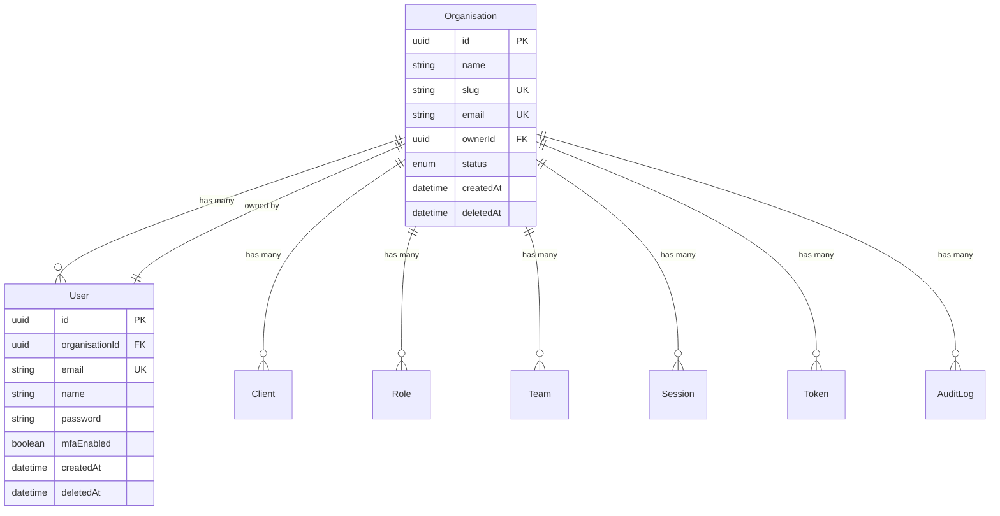
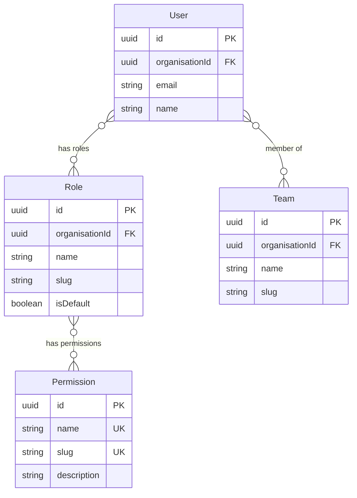
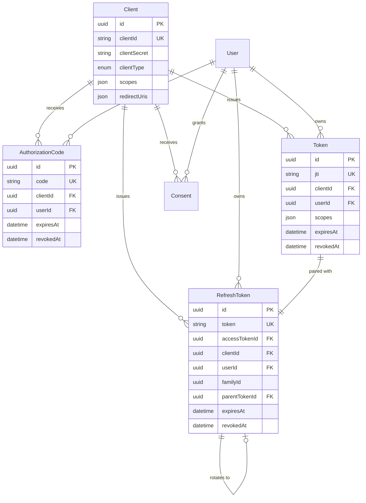
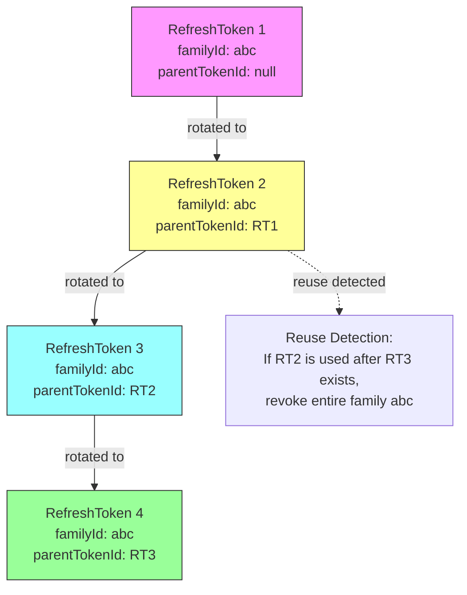
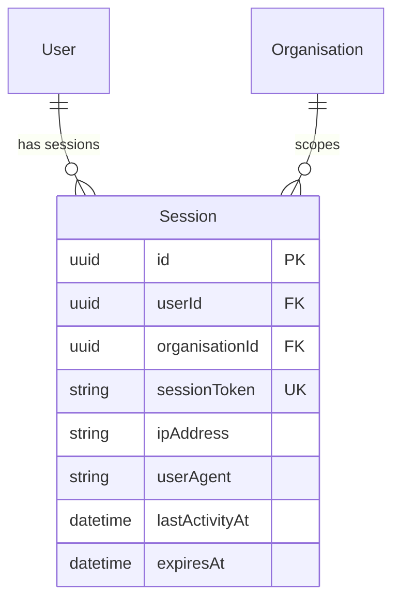
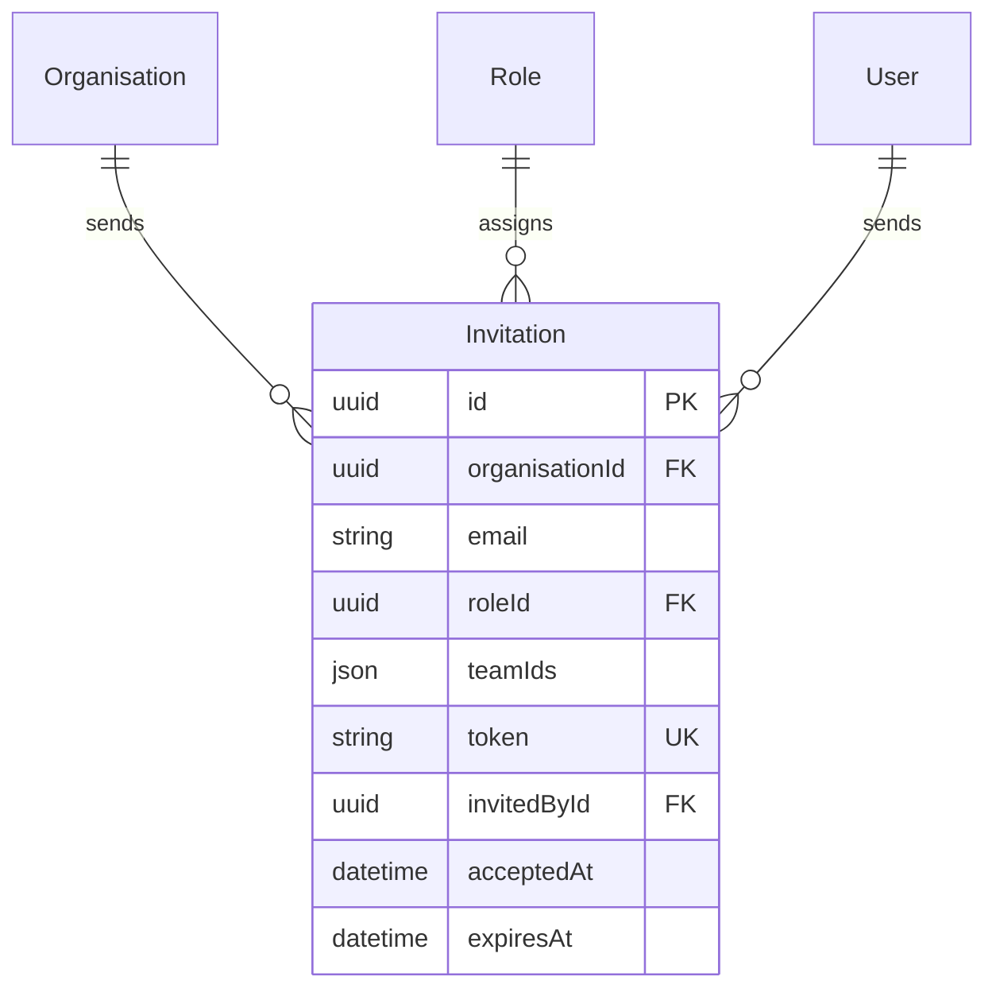
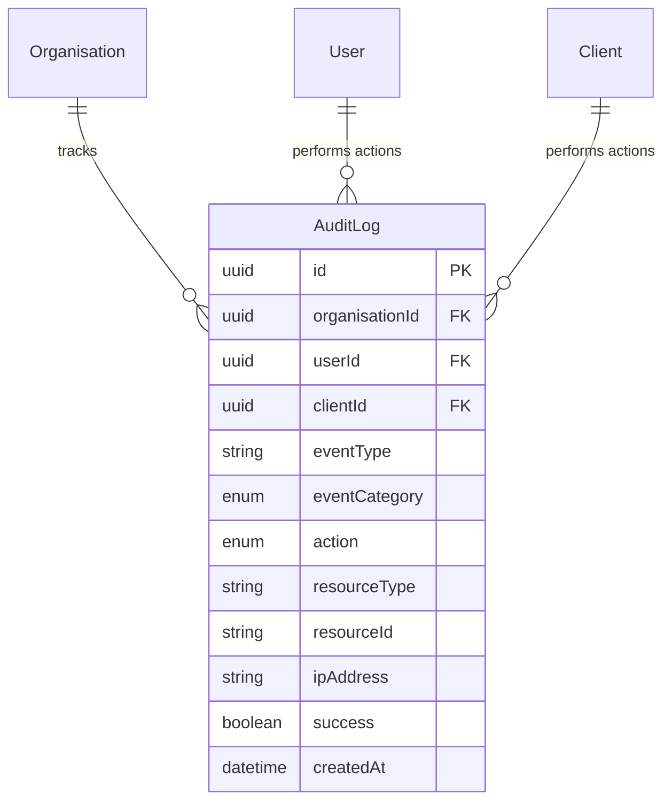
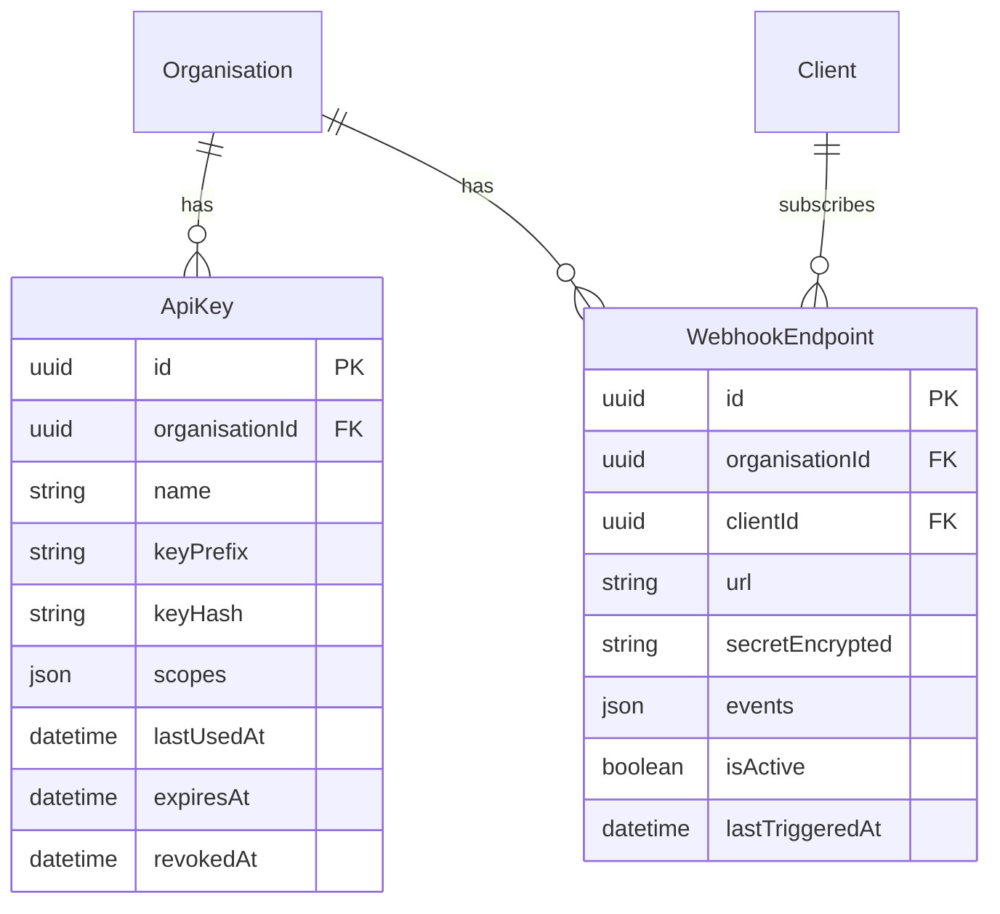
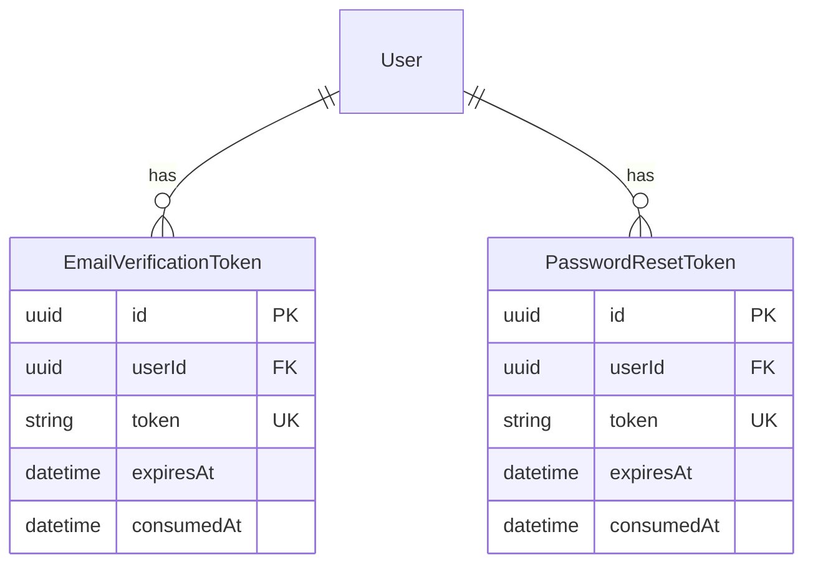

# Entity Relationships

## Entity Relationship Diagrams

### Core Multi-Tenancy Structure



### User Access Control



### OAuth/OIDC Token Flow



### Refresh Token Family



### Session Management



### Invitations & Onboarding



### Audit Logging



### API Keys & Webhooks



### Account Security Tokens



## Relationship Types

### One-to-One

- **Organisation ↔ User (owner)**
  - Organisation has one owner
  - User can own one organisation
  - Foreign key: `Organisation.ownerId`

- **Token ↔ RefreshToken**
  - Each access token can have one refresh token
  - Each refresh token belongs to one access token
  - Foreign key: `RefreshToken.accessTokenId`

### One-to-Many

- **Organisation → Users**
  - One organisation has many users
  - Each user belongs to one organisation
  - Foreign key: `User.organisationId`

- **Organisation → Clients**
  - One organisation has many OAuth clients
  - Each client belongs to one organisation
  - Foreign key: `Client.organisationId`

- **Organisation → Roles**
  - One organisation has many roles
  - Each role belongs to one organisation
  - Foreign key: `Role.organisationId`

- **Client → Tokens**
  - One client can issue many tokens
  - Each token belongs to one client
  - Foreign key: `Token.clientId`

- **User → Sessions**
  - One user can have multiple sessions
  - Each session belongs to one user
  - Foreign key: `Session.userId`

### Many-to-Many

- **User ↔ Role**
  - Users can have multiple roles
  - Roles can be assigned to multiple users
  - Join table: `_UserRole`

- **User ↔ Team**
  - Users can belong to multiple teams
  - Teams can have multiple members
  - Join table: `_TeamUser`

- **Role ↔ Permission**
  - Roles can have multiple permissions
  - Permissions can belong to multiple roles
  - Join table: `_PermissionRole`

### Self-Referencing

- **RefreshToken → RefreshToken (parent)**
  - Refresh tokens form a chain (family)
  - Each token has optional parent
  - Foreign key: `RefreshToken.parentTokenId`
  - Indexed by: `RefreshToken.familyId`

## Cascading Operations

### Soft Delete Organisation

When an organisation is soft-deleted:

1. Mark `Organisation.deletedAt`
2. Soft delete all `User` records
3. Soft delete all `Client` records
4. Hard delete all `Session` records
5. Revoke all `Token` records (set `revokedAt`)
6. Revoke all `RefreshToken` records
7. Hard delete all `AuthorizationCode` records
8. Hard delete all `Invitation` records
9. Revoke all `Consent` records
10. Hard delete all `WebhookEndpoint` records

### Soft Delete User

When a user is soft-deleted:

1. Mark `User.deletedAt`
2. Hard delete all `Session` records
3. Revoke all `RefreshToken` records
4. Revoke all `Token` records
5. Hard delete all `AuthorizationCode` records
6. Revoke all `Consent` records

### Revoke Client

When a client is revoked:

1. Mark `Client.revoked = true`
2. Revoke all `Token` records
3. Revoke all `RefreshToken` records
4. Hard delete all `AuthorizationCode` records

### Revoke Refresh Token Family

When token reuse is detected:

1. Find all tokens with matching `familyId`
2. Revoke all tokens in family (set `revokedAt`)
3. Revoke associated access tokens

## Indexes for Performance

### Primary Keys

All entities use UUID primary keys for global uniqueness and security.

### Unique Constraints

- `Organisation.slug`
- `Organisation.email`
- `User.email` (globally unique)
- `[User.organisationId, User.email]` (composite)
- `Client.clientId`
- `Token.jti`
- `RefreshToken.token`
- `AuthorizationCode.code`
- `Session.sessionToken`
- `[Consent.userId, Consent.clientId]` (composite)

### Foreign Key Indexes

- `User.organisationId`
- `Role.organisationId`
- `Team.organisationId`
- `Client.organisationId`
- `Token.clientId`
- `Token.userId`
- `RefreshToken.clientId`
- `RefreshToken.userId`
- `RefreshToken.familyId`
- `RefreshToken.parentTokenId`
- `Session.userId`
- `AuditLog.organisationId`
- `AuditLog.userId`

### Query Optimization Indexes

- `Token.expiresAt` (cleanup expired tokens)
- `RefreshToken.expiresAt` (cleanup)
- `Session.expiresAt` (cleanup)
- `AuditLog.createdAt` (time-based queries)
- `AuditLog.eventType` (filter by event)

## Data Integrity Rules

### Required Relationships

- Every `User` must belong to an `Organisation`
- Every `Token` must belong to a `Client` and `Organisation`
- Every `RefreshToken` must belong to a `Client`, `User`, and have an `accessTokenId`
- Every `Role` must belong to an `Organisation`

### Optional Relationships

- `Organisation.ownerId` can be null (until owner assigned)
- `User.password` can be null (SSO users)
- `Token.userId` can be null (client credentials grant)
- `RefreshToken.parentTokenId` can be null (first token in family)

### Referential Integrity

Enforced by PostgreSQL foreign key constraints at database level.

## Query Patterns

### Get User with Full Access Context

```typescript
prisma.user.findUnique({
  where: { id: userId },
  include: {
    organisation: true,
    roles: {
      include: {
        permissions: true,
      },
    },
    teams: true,
  },
});
```

### Get Client with Token Statistics

```typescript
prisma.client.findUnique({
  where: { clientId },
  include: {
    _count: {
      select: {
        tokens: true,
        refreshTokens: true,
        consents: true,
      },
    },
  },
});
```

### Get Organisation with Counts

```typescript
prisma.organisation.findUnique({
  where: { slug },
  include: {
    owner: { select: { id: true, name: true, email: true } },
    _count: {
      select: {
        users: true,
        clients: true,
        roles: true,
        teams: true,
      },
    },
  },
});
```

### Get Refresh Token with Family

```typescript
prisma.refreshToken.findUnique({
  where: { token: hashedToken },
  include: {
    client: { select: { clientId: true } },
    parent: true,
    children: true,
  },
});
```

## Related Documentation

- [Database Schema](./database.md)
- [Data Models](./models.md)
- [Service Layer](./services.md)
