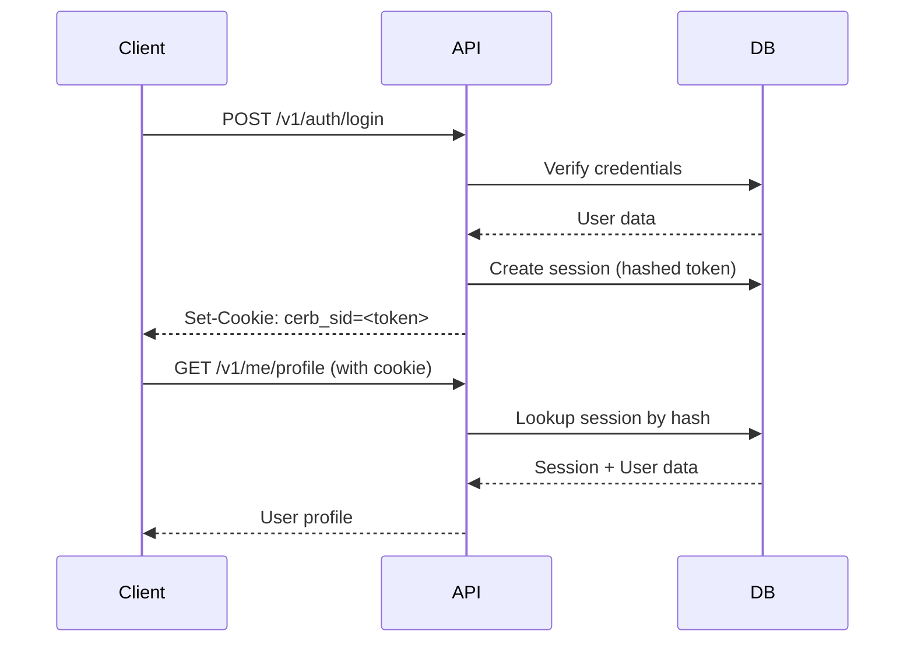

# Security Architecture

## Overview

Cerberus IAM implements defense-in-depth security with multiple layers of protection. This document details security mechanisms, cryptographic implementations, and best practices.

## Security Headers (Helmet)

### Enabled Headers

**X-Content-Type-Options:**

```
X-Content-Type-Options: nosniff
```

Prevents MIME type sniffing attacks.

**X-Frame-Options:**

```
X-Frame-Options: DENY
```

Prevents clickjacking by disallowing iframe embedding.

**Strict-Transport-Security (HSTS):**

```
Strict-Transport-Security: max-age=15552000; includeSubDomains
```

Forces HTTPS connections for 180 days.

**Content-Security-Policy:**

```
Content-Security-Policy: default-src 'self'
```

Restricts resource loading to same origin.

**X-XSS-Protection:**
Disabled in favor of CSP.

## CORS (Cross-Origin Resource Sharing)

### Allow-List Approach

```typescript
const allowList = new Set<string>([
  "http://localhost:3000", // Dev: Admin Web
  "https://localhost:3000",
  "http://localhost:5173", // Dev: Vite
  "https://localhost:5173",
  config.ADMIN_WEB_ORIGIN, // Production
  config.ADMIN_WEB_INTERNAL_ORIGIN, // Internal services
]);
```

### Credentials Support

```typescript
{
  credentials: true, // Allow cookies and Authorization header
}
```

Enables:

- Session cookies
- Bearer tokens in Authorization header

### Origin Validation

```typescript
origin: (origin, callback) => {
  if (!origin || allowList.has(origin)) {
    return callback(null, true);
  }
  return callback(new Error("Origin not allowed by CORS policy"));
};
```

## Authentication Methods

### 1. Session-Based (Cookie)

**Implementation:** Cookie with HTTP-only flag

**Cookie Name:** `cerb_sid` (configurable)

**Security Features:**

- HTTP-only: Prevents XSS access
- Secure: HTTPS only in production
- SameSite: Lax (CSRF protection)
- Hashed storage: SHA-256 in database

**Lifecycle:**



### 2. Bearer Token (JWT)

**Implementation:** JWT in Authorization header

**Header Format:**

```
Authorization: Bearer <jwt>
```

**JWT Structure:**

```json
{
  "header": {
    "alg": "EdDSA",
    "kid": "key-id",
    "typ": "JWT"
  },
  "payload": {
    "sub": "user-id",
    "org": "organisation-id",
    "client_id": "client-id",
    "roles": ["admin", "user"],
    "scope": "openid profile email",
    "aud": "https://api.example.com",
    "iss": "https://auth.example.com",
    "iat": 1640000000,
    "exp": 1640003600,
    "jti": "token-id"
  },
  "signature": "..."
}
```

**Signature Algorithm:** EdDSA (Ed25519) or RS256

**Token Validation:**

1. Verify signature with public key
2. Check expiration (`exp`)
3. Validate issuer (`iss`)
4. Check audience (`aud`)
5. Verify not revoked (database lookup by `jti`)

### 3. API Key

**Implementation:** Bearer token in Authorization header

**Key Format:**

```
cerb_live_<prefix>_<random>
```

**Example:**

```
cerb_live_AbCd1234_f7e3b9c2d8a4e6f1a3b5c7d9e2f4a6b8c1d3e5f7a9b2c4d6e8f1a3b5c7d9
```

**Security Features:**

- Prefix identifies environment (`live`, `test`)
- Display prefix (first 8 chars after prefix)
- Random component: 32 cryptographically secure bytes
- Hashed storage: Argon2id in database
- Scope-based permissions

**Validation:**

1. Extract prefix for lookup
2. Hash full key with Argon2id
3. Compare hash with database
4. Check expiration
5. Check revocation status
6. Update last used timestamp

## Password Security

### Hashing Algorithm: Argon2id

**Configuration:**

```typescript
{
  type: argon2.argon2id,
  memoryCost: 65536,    // 64 MB
  timeCost: 3,          // 3 iterations
  parallelism: 4,       // 4 parallel threads
}
```

**Why Argon2id?**

- Winner of Password Hashing Competition (2015)
- Resistant to GPU/ASIC attacks
- Configurable memory-hardness
- Hybrid mode (Argon2i + Argon2d)

**Password Strength Requirements:**

- Minimum 8 characters
- At least 1 uppercase letter
- At least 1 lowercase letter
- At least 1 number
- Optionally: special characters (per org policy)

**Implementation:**

```typescript
// Hashing
const hash = await argon2.hash(password, {
  type: argon2.argon2id,
  memoryCost: 65536,
  timeCost: 3,
  parallelism: 4,
});

// Verification
const valid = await argon2.verify(hash, password);
```

**Password Reset Flow:**

1. User requests reset
2. Generate random token (32 bytes)
3. Store hashed token with 1-hour expiration
4. Send email with token link
5. User submits new password with token
6. Verify token, hash new password, update user

## Multi-Factor Authentication (MFA)

### TOTP (Time-Based One-Time Password)

**Algorithm:** RFC 6238

**Implementation:** `otplib` library

**Secret Generation:**

```typescript
const secret = authenticator.generateSecret(); // 32 base32 chars
```

**QR Code URI:**

```typescript
const uri = authenticator.keyuri(
  email, // Account name
  "Cerberus IAM", // Issuer
  secret,
);
```

**Verification:**

```typescript
const valid = authenticator.verify({
  token: userToken,
  secret: encryptedSecret,
});
```

**Security Features:**

- Window: ±1 time step (30 seconds)
- Secret encrypted at rest (AES-256-GCM)
- Backup codes for recovery

### Backup Codes

**Generation:**

```typescript
const codes: string[] = [];
for (let i = 0; i < 10; i++) {
  codes.push(generateSecureToken(4).toUpperCase());
}
```

**Format:** `ABCD-1234` (4 random hex bytes)

**Storage:** Argon2id hashed (one-time use)

**Usage:**

1. User enters backup code
2. Hash code with Argon2id
3. Compare with stored hashes
4. Mark as used (delete from array)
5. Warn if low backup codes remaining

## Token Management

### Access Token (JWT)

**Lifetime:** 1 hour (configurable per client)

**Storage:** Database record for revocation checking

**Revocation:**

- Manual revocation via API
- Automatic on user/client deletion
- Cascade on organisation deletion

### Refresh Token

**Lifetime:** 30 days (configurable per client)

**Storage:** Hashed with SHA-256 in database

**Rotation:** Automatic on each use

**Reuse Detection:**

```typescript
// Pseudocode
if (token.revokedAt) {
  // Token already used - REUSE DETECTED
  revokeTokenFamily(token.familyId);
  return null;
}

if (hasChildren(token)) {
  // Token already rotated - REUSE DETECTED
  revokeTokenFamily(token.familyId);
  return null;
}

// Normal rotation
revoke(currentToken);
createNewToken(familyId, parentTokenId);
```

**Family Revocation:**
When reuse detected, revoke:

1. All refresh tokens with same `familyId`
2. All associated access tokens

## CSRF Protection

### Implementation: Double-Submit Cookie

**Library:** `csurf`

**Cookie Name:** `cerb_csrf`

**Configuration:**

```typescript
{
  cookie: {
    httpOnly: true,
    sameSite: 'lax',
    secure: true, // Production only
  },
  ignoreMethods: ['GET', 'HEAD', 'OPTIONS'],
}
```

**Flow:**

1. Client makes GET request
2. Server generates CSRF token
3. Server sets `cerb_csrf` cookie
4. Server returns token in `X-CSRF-Token` header
5. Client includes token in POST/PUT/DELETE requests via:
   - `X-CSRF-Token` header, OR
   - `_csrf` body field

**Validation:**

- Compare cookie value with submitted token
- Reject if mismatch

**Protected Routes:**

- All POST/PUT/DELETE endpoints with session auth
- Excludes: GET, HEAD, OPTIONS
- Excludes: Bearer token auth (stateless)

## Rate Limiting

### Implementation: Token Bucket Algorithm

**Library:** `rate-limiter-flexible`

**Storage:** In-memory (production: Redis)

### Limiters

**Global API Rate Limit:**

- 120 requests per 60 seconds
- Key: IP address
- Response: 429 Too Many Requests

**Authentication Rate Limit:**

- 30 requests per 60 seconds
- Key: IP address
- Routes: `/v1/auth/*`
- Prevents brute force attacks

**Token Endpoint Rate Limit:**

- 30 requests per 60 seconds
- Key: IP address
- Route: `/oauth2/token`
- Prevents token abuse

**Custom Rate Limiters:**

```typescript
const perUserLimiter = createRateLimitMiddleware({
  points: 100,
  duration: 60,
  keyGenerator: (req) => req.user?.id || req.ip,
});
```

**Response Headers:**

```
X-RateLimit-Limit: 120
X-RateLimit-Remaining: 95
X-RateLimit-Reset: 1640003600
Retry-After: 30
```

## Secret Encryption

### Algorithm: AES-256-GCM

**Use Cases:**

- TOTP secrets
- Webhook signing secrets
- SAML private keys (future)

**Key Derivation:**

```typescript
const encryptionKey = Buffer.from(config.SECRET_ENCRYPTION_KEY, "base64");
// Must be 32 bytes (256 bits)
```

**Encryption:**

```typescript
const iv = randomBytes(12); // 96-bit IV
const cipher = createCipheriv("aes-256-gcm", encryptionKey, iv);
const ciphertext = cipher.update(plaintext, "utf8") + cipher.final();
const authTag = cipher.getAuthTag(); // 128-bit auth tag

const encrypted = Buffer.concat([iv, authTag, ciphertext]).toString("base64");
```

**Decryption:**

```typescript
const buffer = Buffer.from(encrypted, "base64");
const iv = buffer.subarray(0, 12);
const authTag = buffer.subarray(12, 28);
const ciphertext = buffer.subarray(28);

const decipher = createDecipheriv("aes-256-gcm", encryptionKey, iv);
decipher.setAuthTag(authTag);

const plaintext = decipher.update(ciphertext) + decipher.final("utf8");
```

**Security Properties:**

- Authenticated encryption (integrity + confidentiality)
- Random IV per encryption
- No key reuse (IV changes each time)

## JWT Signing Keys

### Key Generation

**EdDSA (Ed25519):**

```typescript
const { publicKey, privateKey } = await jose.generateKeyPair("EdDSA");
```

**RS256 (RSA-2048):**

```typescript
const { publicKey, privateKey } = await jose.generateKeyPair("RS256", {
  modulusLength: 2048,
});
```

**Why EdDSA?**

- Smaller keys (32 bytes vs 256 bytes)
- Faster signing and verification
- Simpler implementation
- Resistant to timing attacks

### Key Rotation

**Automatic Rotation:**

- New key generated every 30 days (configurable)
- Old keys kept active for verification (grace period)
- Deactivated after 60 days

**Manual Rotation:**

```bash
# Rotate immediately
npm run keys:rotate
```

**JWKS Endpoint:**

```json
{
  "keys": [
    {
      "kid": "key-1",
      "kty": "OKP",
      "alg": "EdDSA",
      "use": "sig",
      "crv": "Ed25519",
      "x": "public-key-base64"
    }
  ]
}
```

## Webhook Security

### Signature Generation

**Algorithm:** HMAC-SHA256

**Header:**

```
X-Cerberus-Signature: t=<timestamp>,v1=<signature>
```

**Signature Calculation:**

```typescript
const payload = `${timestamp}.${JSON.stringify(event)}`;
const signature = createHmac("sha256", webhookSecret).update(payload).digest("hex");

const header = `t=${timestamp},v1=${signature}`;
```

**Verification (Client-side):**

```typescript
const [t, v1] = header.split(",").map((p) => p.split("=")[1]);
const expectedSignature = hmac(webhookSecret, `${t}.${body}`);

if (v1 !== expectedSignature) {
  throw new Error("Invalid signature");
}

if (Date.now() - parseInt(t) > 300000) {
  // 5 minutes
  throw new Error("Timestamp too old");
}
```

## Audit Logging

### Logged Events

**Authentication:**

- User login (success/failure)
- User logout
- Password reset
- MFA enrollment/unenrollment
- Session creation/revocation

**Authorization:**

- Permission checks (success/failure)
- Role assignment/removal
- Client authorization

**Data Operations:**

- User CRUD operations
- Client CRUD operations
- Role/permission changes
- Organisation settings changes

**Security Events:**

- Failed login attempts
- Token reuse detection
- CSRF token mismatch
- Rate limit exceeded
- Webhook delivery failures

### Log Fields

```typescript
{
  id: 'uuid',
  organisationId: 'uuid',
  userId: 'uuid | null',
  clientId: 'uuid | null',
  eventType: 'user.login',
  eventCategory: 'auth',
  action: 'login',
  resourceType: 'user',
  resourceId: 'uuid',
  ipAddress: '192.168.1.1',
  userAgent: 'Mozilla/5.0...',
  metadata: {
    mfaUsed: true,
    loginMethod: 'password',
  },
  success: true,
  errorMessage: null,
  createdAt: '2025-01-26T10:00:00Z',
}
```

### Retention Policy

**Default:** 90 days

**Compliance:** Can be extended to 7 years for regulated industries

**Cleanup:**

```typescript
await prisma.auditLog.deleteMany({
  where: {
    createdAt: {
      lt: new Date(Date.now() - 90 * 24 * 60 * 60 * 1000),
    },
  },
});
```

## Security Best Practices

### 1. Never Log Sensitive Data

```typescript
// BAD
logger.info({ password: user.password });

// GOOD
logger.info({ userId: user.id, action: "password_changed" });
```

### 2. Use Parameterized Queries

Prisma automatically uses parameterized queries. Never use raw SQL with string concatenation.

### 3. Validate All Input

```typescript
const userSchema = z.object({
  email: z.string().email(),
  password: z.string().min(8),
});

const validated = userSchema.parse(req.body);
```

### 4. Set Secure Cookie Flags

```typescript
res.cookie("cerb_sid", token, {
  httpOnly: true, // Prevent XSS
  secure: true, // HTTPS only
  sameSite: "lax", // CSRF protection
  maxAge: 3600000, // 1 hour
});
```

### 5. Implement Defense in Depth

- Multiple layers of security
- Fail securely (deny by default)
- Principle of least privilege
- Regular security audits

### 6. Keep Dependencies Updated

```bash
npm audit              # Check vulnerabilities
npm audit fix          # Auto-fix vulnerabilities
npm outdated           # Check for updates
```

### 7. Use Environment Variables for Secrets

Never commit secrets to git:

```env
# .env (gitignored)
DATABASE_URL=postgresql://...
SECRET_ENCRYPTION_KEY=base64-encoded-key
JWT_PRIVATE_KEY=...
```

## Compliance Considerations

### GDPR

**Right to Access:**

- `DataExportService` provides user data export

**Right to Erasure:**

- `DataErasureService` implements permanent deletion
- Anonymize audit logs (retain for compliance)

**Data Breach Notification:**

- Audit logs track all access
- Alert on suspicious activity (rate limit, token reuse)

### SOC 2

**Access Controls:**

- RBAC with granular permissions
- Audit logging of all administrative actions

**Security Monitoring:**

- Structured logging with request IDs
- Failed authentication attempts tracked

**Data Encryption:**

- At rest: Database encryption (PostgreSQL)
- In transit: HTTPS/TLS 1.3

## Related Documentation

- [Authentication Flow](./auth-flow.md)
- [Token Management](./tokens.md)
- [Cryptography Details](./cryptography.md)
- [Middleware Pipeline](./middleware.md)
